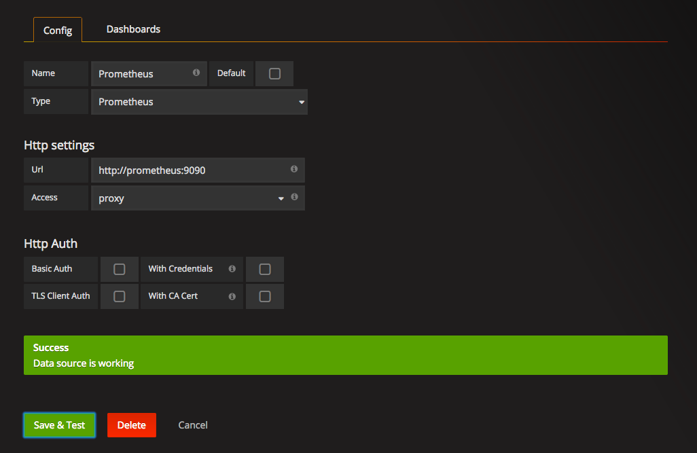
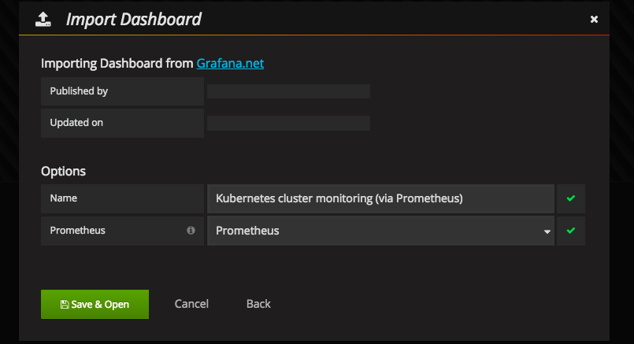
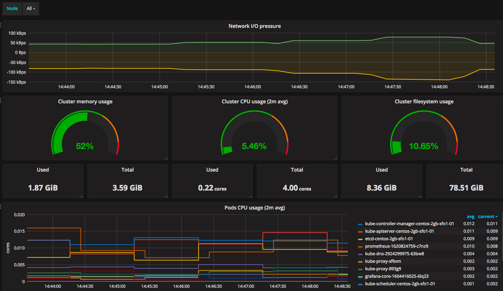

# Deployments with Kubernetes

本文将介绍如何使用 kubernetes 部署微服务，包括 服务发现，监控，路由，日志。用实际的例子来演示自动化流程。主要分为以下几个部分:

1. 5分钟搭建 K8S 集群
2. 部署 CNI 网络
3. 部署监控服务
4. 部署网关
5. 部署日志服务
6. 部署一个应用


## 5分钟搭建 K8S 集群

第一次完全手动搭建集群大约花了一周时间，主要的问题是在于  

1. K8S的组件多，每个程序的参数有不少，哪些是关键的参数需要花时间搞清楚。
2. 万恶的墙，代理访问外网比较慢
3. CNI网络问题，主要是 CNI 网段和云上的局域网网段冲突了，基础知识缺失导致
4. K8S 的证书和验证方式不清楚

本文相关代码位于[github](https://github.com/silentred/k8s-tut), 欢迎star。

可以参考我之前的[博文](https://segmentfault.com/a/1190000007673785)，即便是完全熟悉部署流程，不写脚本的情况下，如果纯手动 setup 或者 tear down 一个集群，都是比较耗时间的。

直到，发现了这个工具 kubeadm, 世界美好了。

这个工具对操作系统有限制， ubuntu 16.4 或 centos 7 以上。其实当初也看到了这个工具， 不过 因为系统限制，并且kubeadm还在alpha版本，又想手动撸一遍部署过程，所以没直接采用。 不过 kubeadm 不建议在生产环境中使用，在 官方文档中的 limitation 中有详细解释.

[文档](https://kubernetes.io/docs/getting-started-guides/kubeadm/) 中第一点就说了， kubeadm部署的是 single master，意味着不是高可用，谨慎使用。 但是作为演示实例再合适不过。

小插曲: 因为最近发布的 k8s 1.6 的 kubeadm 有一个bug，导致用以下步骤安装会有问题，为此社区里有人提了一个patch, 步骤有些多，我写在本文最后了。

开始部署步骤:

1. 在 Digital Ocean 中开三台机器, centos 7，建议2C2G，按小时计费用不了多少钱，用完就销毁。 如果还没有注册账号，并且觉得本文对你有帮助，可以用我的 referral link 注册，可以得到 10美金, [链接](https://m.do.co/c/821db079aed2)
2. 登录三台机器，安装必要组件.
	```
	yum clean
	yum update -y
	cat <<EOF > /etc/yum.repos.d/kubernetes.repo
	[kubernetes]
	name=Kubernetes
	baseurl=http://yum.kubernetes.io/repos/kubernetes-el7-x86_64
	enabled=1
	gpgcheck=1
	repo_gpgcheck=1
	gpgkey=https://packages.cloud.google.com/yum/doc/yum-key.gpg
		https://packages.cloud.google.com/yum/doc/rpm-package-key.gpg
	EOF
	setenforce 0
	yum install -y docker kubelet kubeadm kubectl kubernetes-cni
	systemctl enable docker && systemctl start docker
	systemctl enable kubelet && systemctl start kubelet
	```
3. 选择一台作为master, 运行
	```
	kubeadm init

	# 输出
	Your Kubernetes master has initialized successfully!

	You should now deploy a pod network to the cluster.
	Run "kubectl apply -f [podnetwork].yaml" with one of the options listed at:
		http://kubernetes.io/docs/admin/addons/

	You can now join any number of machines by running the following on each node:

	kubeadm join --token=e344fa.e007ce406eb41f07 104.236.166.119
	```
	完成后会看到提示: `kubeadm join --token=311971.7260777a25d70ac8 104.236.166.119`
4. 在其他两台机器上分别运行以上提示的命令
5. 在 master 上查看状态, `kubectl get nodes`, 如果看到一共有2个node，一个master， 则表示集群创建成功。

## 部署CNI网络

kubeadm 自动部署了一个插件，就是 kube-dns, 用于服务发现，但是到这里你会发现 kube-dns 这个服务没有启动成功，因为我们还没有部署CNI网络。

```
kubectl get pods --all-namespaces | grep dns
```

这里有比较多的选择，我使用了 calico，因为性能比较好，支持一键部署。 这里有一篇对比容器网络的文章，优缺点介绍比较全面， [Battlefield: Calico, Flannel, Weave and Docker Overlay Network](http://chunqi.li/2015/11/15/Battlefield-Calico-Flannel-Weave-and-Docker-Overlay-Network/)

配置文件在cni目录下，或者可以直接在master运行： 
`kubectl create -f http://docs.projectcalico.org/v2.0/getting-started/kubernetes/installation/hosted/kubeadm/calico.yaml`

再次查看 dns 服务是否运行成功吧。

```
# 按需安装 git 和 dig
yum install -y bind-utils git 
```

## 监控

在部署之前，我们需要对两台node标记角色，k8s是通过label来自定义各个资源的类型的。
首先确定两台node的name, 通过 `kubectl get nodes`来查看，之后挑选其中一台作为前端机器(frontend).

```
kubectl label node centos-2gb-sfo1-03 role=frontend
```
这里把centos-2gb-sfo2-node1换成你的 node name

### Prometheus

应用 monitor 目录下的两个配置文件，如下

```
kubectl create -f prometheus.config.yaml
kubectl create -f prometheus.deploy.yaml
```

接下来打开 http://front-end-ip:30900 就能看到 prometheus 的界面


### Grafana

```
kubectl create -f grafana.deploy.yaml
```

打开 http://front-end-ip:30200 就能看到 grafana 的界面.

1. 还需要添加一个 Data Source. 选择 Promethues, 地址填上:
	http://promethues:9090
	因为有kube-dns，所以这样就能访问 pod 中的 service

	

2. 添加模板，内容为  grafana.config.k8s.json, 这个模板是针对 k8s 集群的仪表模板，添加时选择对应的 Data Source，然后就能看到效果。
	
	

## 网关

类似上面的步骤，配置文件在 gateway 目录下，运行
```
kubectl create -f traefik.yaml
```
这样在 http://front-end-ip:30088 能看到 网关的 dashboard。

traefik 可以监听 etcd 中注册的 ingress 的变化，根据 ingress 资源来自动配置路由， 下面会有具体的示例。最后的效果是， 后端服务的配置文件中定义他自己的 服务domain 和 prefix, traefik会自动添加这个路由, 这样就可以通过gateway来访问后端服务了。

## 日志收集

官方有推荐的Log系统: cAdvisor 和 Heapster. 
我比较偏爱 ELK, 主要是生态比较好。有两种方式应用：

1. 第一种是每个Pod都多加一个 sidecar - Filebeat， 在每个后端服务配置文件中指定本地log的路径(利用 k8s 的 hostPath 这个volume)，在filebeat的配置中指定这个路径，实现日志收集

2. 还有一种是Filebeat作为 DaemonSet 运行在每台机器, 这样每台机器只有一个 filebeat 运行，监听一个指定目录；后端服务约定好log都写入这个目录的子目录中，这样也能达到收集效果。

我比较推荐第二种方式，工作量稍微小一些。

## 第一个服务

终于到了这个紧张刺激的环节。

源文件在 hello-app 目录下，一个简单的 http service, 主要包含两个路由:

1. /metrics 返回 prometheus 抓取的数据格式
2. / 其他Path，返回一个随机id和URI

log 日志输入 /tmp/hello-log/hello-app.log;

想要达到的效果是：
1. 配置文件中配好路由，自动注册到 gateway
2. promethues 自动发现服务，抓取 http://hello:8080/metrics 的监控数据
3. 日志能够自动收集

app 的配置文件位于 hello-app 目录下, 运行：
```
kubectl create -f hello.yaml
```

接着去 gateway 和 prometheus 的 dashboard 看下，会发现服务已经被发现;


再测试一下通过gateway是否能访问到 hello-app 这个服务:

```
curl http://front-end-ip:30087/v1/hello -H 'Host: www.hello.local'
#结果为：
ID:5577006791947779410 path:/hello
```

## 编译安装 kubeadm

1. 下载 kubernetes 项目， checkout v1.6.0, 必须是这个tag
2. `cherry-pick 89557110ed4693a7d23e515e738ced266e099365`
3. `KUBE_BUILD_PLATFORMS=linux/amd64 hack/make-rules/build.sh cmd/kubeadm`
4. 把生成的 _output 文件打包，放入服务器上
5. 按照本文第一部分的步骤 yum 安装 docker, kubelet
6. 编辑文件 `/etc/systemd/system/kubelet.service.d/10-kubeadm.conf` 添加 参数`--cgroup-driver=systemd`
7. `sudo systemctl daemon-reload && sudo systemctl restart kubelet.service`
8. `kubeadm init` 能完成，但是 node 状态是 not-ready，因为 cni 没有配置.
9. 复制 `/etc/kubernetes/admin.conf` 文件到 `~/.kube/config` 然后 执行 `kubectl get nodes`才可以，因为新版的apiserver启动时，把 insecure-port 禁用了，8080端口不再可用.

## Alpine Linux

这次还遇到一个问题， alpine的docker镜像使用不顺利，ubuntu, centos下编译的文件在 alpine 下无法运行， 记得之前还运行成功过，这次得仔细找找原因。